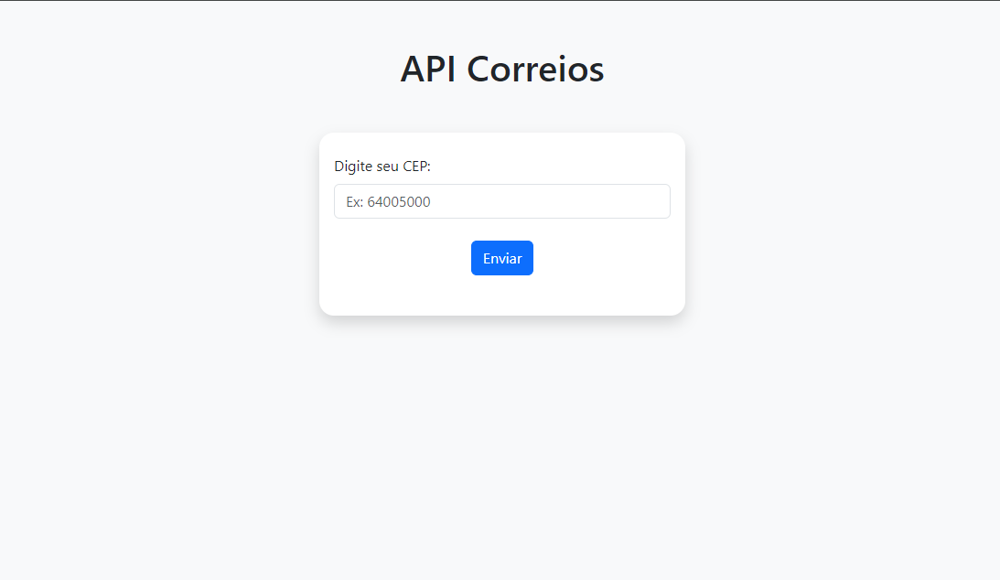
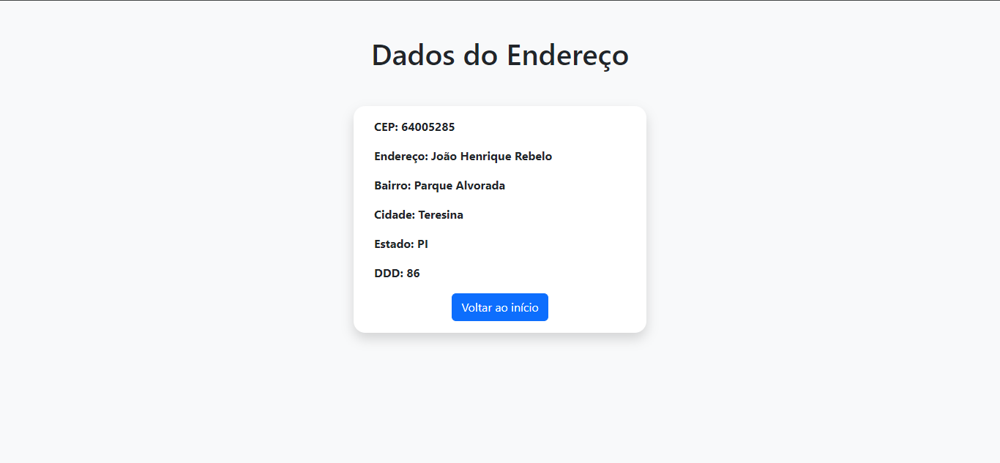

<h1 align='center'> Django API Correios </h1>

          
          

Este é um pequeno projeto de uma pagina web utilizando o Framework Django e utilizando a API dos Correios para localizar endereços.

<h2 align='center'>Imagens do Projeto</h2>

